# Auto Title – Intelligent Title Generation from Text


[](https://github.com/yourusername/autotitle-nlp)

---

## Overview

**Auto Title** is a **professional, production-ready NLP system** that automatically generates **concise, accurate, and human-like titles** from long-form text such as articles, research papers, blog posts, or reports.

It uses a **hybrid AI pipeline** combining:
- **Abstractive generation** (BART + T5)
- **Extractive keyphrase fallback** (YAKE + TextRank)
- **Semantic scoring** (Sentence-Transformers)
- **Smart post-processing** (length, capitalization, clickbait filtering)

This project is a complete, advanced, and professional Python implementation of AutoTitle – Intelligent Title Generation from Text, ready to run as a standalone script or be integrated into a larger project.

---

## Features

| Feature | Description |
|--------|-----------|
| **Hybrid Generation** | Abstractive + Extractive fallback |
| **Semantic Ranking** | Uses cosine similarity with lead sentences |
| **Confidence Scoring** | Quantifies title quality |
| **Post-Processing** | Enforces 5–12 words, title case, removes quotes |
| **Clickbait Filter** | Blocks sensationalist phrases |
| **Batch Processing** | Generate titles for multiple texts |
| **Lazy Model Loading** | Efficient memory usage |
| **CLI & API Ready** | Easily integrable into apps |

---

## Installation

```bash
# Clone the repository
git clone https://github.com/aligh993/Auto-Title.git
cd Auto-Title

# Create virtual environment (recommended)
python -m venv venv
source venv/bin/activate  # Linux/Mac
# or
venv\Scripts\activate     # Windows

# Install dependencies
pip install -r requirements.txt

# Download spaCy model
python -m spacy download en_core_web_sm
```

## Requirements

```txt
torch>=2.1.0
transformers>=4.40.0
sentence-transformers>=2.5.0
spacy>=3.7.0
yake>=0.4.8
numpy>=1.24.0
```

## Quick Start with Output

```bash
python autotitle_advanced.py
```
*Output*:
```txt
Loading models... (this may take a moment)
AutoTitle ready!

============================================================
 AUTO TITLE GENERATION RESULT 
============================================================
Title:       AI Predicts Alzheimer's 6 Years Early
Method:      Abstractive
Confidence:  0.892
Words:       6
============================================================
```

## Batch Example with Output

```python
texts = [
    "Global temperatures reached record highs in 2024, with July being the hottest month ever recorded.",
    "A new species of deep-sea fish was discovered near the Mariana Trench.",
    "Tesla announced a breakthrough in solid-state battery technology."
]

for i, text in enumerate(texts, 1):
    res = generator.generate(text, max_words=8)
    print(f"{i}. {res['title']} ({res['method']})")
```
*Output*:
```txt
Batch Processing Example:
1. Global Temperatures Hit Record Highs (extractive)
2. New Deep-Sea Fish Species Discovered (abstractive)
3. Tesla Unveils Solid-State Battery Breakthrough (abstractive)
```

## How It Works

[](diagram.svg)

## Project Structure

```txt
Auto-Title/
├── autotitle_advanced.py    # Main intelligent title generator
├── requirements.txt         # Dependencies
├── README.md                # This file
├── diagram.svg              # Model Diagram
├── data/
│   └── sample_articles.txt  # Test data
└── models/                  # (Optional) Fine-tuned models
```

## Use Cases

- **News Aggregators** – Auto-title incoming articles
- **SEO Optimization** – Generate click-worthy blog titles
- **Research Papers** – Convert abstracts to concise titles
- **Email Automation** – Smart subject line generation
- **Content Curation** – Summarize reports and documents
- **Document Labeling** – Auto-tag PDFs and reports

## Contributing

1. Fork the repo
2. Create a branch:
    ```bash
    git checkout -b feature/new-model
    ```
3. Commit changes:
    ```bash
    git commit -m "Add T5 refinement layer"
    ```
4. Push and open a Pull Request
5. Include tests and update docs

## License

This project is licensed under the `AGPL-3.0` License. See the `LICENSE` file for details.

## Author

- Ali Ghanbari

- GitHub: [@aligh993](https://github.com/aligh993)

- LinkedIn: [linkedin.com/in/AliGhanbari](https://www.linkedin.com/in/ali-ghanbari-10aa30b6/)

- Email: alighanbari446@gmail.com

***One line to capture a thousand words.***